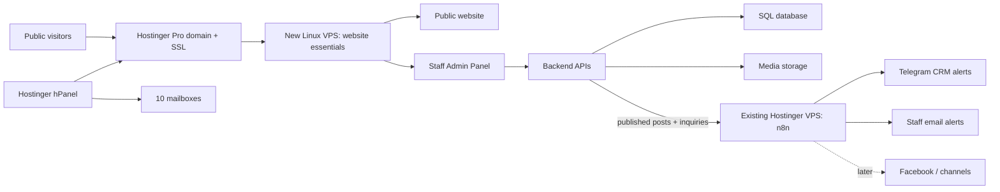

# Burmese Catholic Community of Western Australia — Dynamic Community Platform

Burmese Catholic Community of Western Australia is a modern, database-backed charity and community platform. It combines a public storytelling website with a separate staff Admin Panel, publishing APIs, verified media storage, private community inquiries, and an approval-aware editorial workflow.

The current release is a local-first foundation. It is ready for design/content review before GitHub and production deployment. Preview content is intentionally labelled and does not make unverified impact claims.

The Australia-inspired palette remains in place. The public wordmark now uses the organisation-supplied Burmese Catholic Community of Western Australia logo; it does not claim Australian Government endorsement.

## What is included

- Distinctive responsive public website at `/`
- Dedicated public pages at `/about`, `/our-work`, `/stories`, `/approach`, and `/get-involved`
- Staff editorial dashboard at `/admin`
- Password-based staff sessions and role-based Team Access
- Owner-managed account creation, modification, disabling, and password reset
- Post API at `/api/posts`
- Media upload API at `/api/media`
- Draft, review, and published content states with administrator approval
- Admin-selected public destination for every content item
- Future channel preferences without external distribution
- D1/SQLite-compatible relational schema and generated migration
- R2-compatible media storage
- Post revision history and protected staff audit records
- Login throttling, same-origin write protection, hardened upload validation, and security headers
- Private English-learning navigation, donation/funding, volunteer, partnership, and general inquiries
- Direct links to official AMEP providers and the ACNC Charity Register
- Administrator-managed headline, summary, and statement for every public page
- Open Graph and favicon artwork
- Optional machine-to-machine write token for approved automation
- Private MR.Kyaw Zin Admin assistant for drafting and content review

## Architecture



Hosting split:

- **Hostinger Pro** — domain, SSL certificates, and up to 10 organisation mailboxes.
- **Existing Hostinger VPS (n8n)** — keep using the recently built BCC workflows there: `BCC Inquiry Alert` and `BCC Publish Distribution`. Do not reinstall n8n on the new VPS.
- **New Linux VPS** — website essentials only: app runtime, database, media, reverse proxy, backups, and monitoring.
- **hPanel vs Admin Panel** — hPanel is owner infrastructure; the application Admin Panel is staff content and accounts only. The hPanel password is never stored in the application database.

## Folder structure

```text
app/
  admin/             staff editorial dashboard
  about/             dedicated public About page
  our-work/          dedicated public program page
  stories/           dedicated public news and stories page
  approach/          dedicated public governance and approach page
  get-involved/      dedicated public participation page
  api/posts/         post create, edit, review, publish, and revision history
  api/media/         verified media upload and metadata
  api/inquiries/     private community inquiry intake and staff queue
  api/audit/         administrator-visible protected action history
  api/pages/         administrator-managed public page copy
  api/auth/session/  password sign-in and secure session lifecycle
  api/users/         owner-only staff account management
  api/ai/             authenticated MR.Kyaw Zin assistant endpoint
  components/        public-site interface
  lib/content.ts     preview content and shared types
db/schema.ts         relational data model
drizzle/             generated SQL migrations
public/              social preview and favicon artwork
.openai/hosting.json database and object-storage bindings
```

## Technology

- React 19 and TypeScript
- vinext / Vite full-stack runtime
- Drizzle ORM
- Cloudflare D1-compatible SQL
- Cloudflare R2-compatible object storage
- Cloudflare Worker security-header enforcement

This architecture can later be adapted to a conventional Node/PostgreSQL deployment if the selected Hostinger product requires it.

## Local installation

Requires Node.js `>=22.13.0`.

```bash
npm install
cp .env.example .env.local
npm run dev
```

Open:

- Public website: `http://localhost:3000`
- Staff Admin Panel: `http://localhost:3000/admin`

Validation:

```bash
npm run build
npm run db:generate
```

## Environment variables

```text
BOOTSTRAP_ADMIN_EMAIL=
BOOTSTRAP_ADMIN_PASSWORD=
DB_HOST=localhost
DB_PORT=3306
DB_USER=
DB_PASSWORD=
DB_NAME=
ADMIN_WRITE_TOKEN=
N8N_PUBLISH_WEBHOOK=
N8N_INQUIRY_ALERT_WEBHOOK=
N8N_INQUIRY_WEBHOOK_SECRET=
N8N_SUBSCRIBE_ALERT_WEBHOOK=
N8N_EVENT_MAIL_WEBHOOK=
CRM_ALERTS_ENABLED=false
N8N_BASE_URL=
N8N_API_KEY=
MR_KYAW_ZIN_AI_ENABLED=false
OPENAI_API_KEY=
OPENAI_MODEL=gpt-5.6
OPENAI_VECTOR_STORE_ID=
```

`BOOTSTRAP_ADMIN_EMAIL` and `BOOTSTRAP_ADMIN_PASSWORD` are protected one-time deployment secrets. When the database has no staff users, those credentials create the first Owner during sign-in. The Owner then creates Administrator and Editor accounts in Team Access. No default password is committed to Git.

Human staff use an HttpOnly, SameSite session cookie. Passwords are stored only as salted PBKDF2-SHA256 hashes. `ADMIN_WRITE_TOKEN` is optional and reserved for approved machine-to-machine automation through the `x-admin-token` header.

This dynamic website is associated with n8n AI automation. When
`N8N_PUBLISH_WEBHOOK` is set, an authorised publish posts to n8n. When
`CRM_ALERTS_ENABLED=true` and `N8N_INQUIRY_ALERT_WEBHOOK` are set, new community
inquiries also post to n8n. Draft and review content is never sent. Facebook and
Telegram channel credentials remain optional additions inside the n8n workflows.

## MR.Kyaw Zin private assistant

MR.Kyaw Zin is installed as a compact floating chat button in the authenticated
Admin Dashboard. The interface is visible in setup mode without an API key.
Live AI replies use the OpenAI Responses API only after
`MR_KYAW_ZIN_AI_ENABLED=true` and `OPENAI_API_KEY` are stored as protected
server-side secrets.

The assistant can help draft, summarise, check claims, and suggest a public
destination. It is grounded in a versioned, repository-owned project knowledge
source that separates confirmed work from planned or unconfigured work. If an
answer is unsupported, it says that it does not know from the verified project
information instead of filling the gap. It cannot publish, schedule, distribute to social channels, change
staff access or passwords, access Hostinger hPanel, or create unsupported
government claims. Every result remains a private suggestion until human review.

`OPENAI_VECTOR_STORE_ID` is optional. When configured, the Responses API can
also search approved project documents uploaded to an OpenAI vector store.
Only reviewed documents should be added to that knowledge base.

## Content API

### `GET /api/posts`

Returns posts ordered by creation time.

### `POST /api/posts`

Accepts:

```json
{
  "title": "Neighbourhood food day",
  "excerpt": "A short, verified summary.",
  "body": "Approved public copy.",
  "category": "Community",
  "status": "review",
  "channels": ["facebook", "telegram"]
}
```

Supported states are `draft`, `review`, and `published`. Editors can submit for
review; only Administrators and Owners can publish.

Every content item also has a `placement` value:

- `about`
- `our-work`
- `stories`
- `approach`
- `get-involved`

Public section pages request only published records for their own placement. The Admin Panel uses a protected staff scope to manage drafts and review records across all destinations.

### Learning and donation navigation

The Get Involved page links visitors directly to authorised Adult Migrant
English Program providers and the ACNC Charity Register. Visitors may also send
a private navigation or donation/funding enquiry for Administrator review.
The website does not decide AMEP eligibility, enrol learners, schedule training,
accept money, or collect payment details.

### `POST /api/media`

Accepts a multipart upload in a `file` field. Current supported formats are
JPEG, PNG, GIF, WebP, and PDF files up to 15 MB. The server verifies file
signatures rather than trusting browser MIME metadata; SVG uploads are rejected.

## Editorial and automation workflow

1. Staff create or edit a draft.
2. An authorised reviewer verifies claims, consent, media rights, and public copy.
3. An Administrator or Owner publishes the reviewed item to the website.
4. The backend records the prior revision and a protected audit event.
5. If n8n webhooks are configured, only the published event (and separately
   inquiry alerts) are handed to AI automation. Drafts are never sent.

Historical Facebook content must be imported only after account authorisation and ownership review. It should enter the system as draft/review content, not publish automatically.

## Deployment

### GitHub

After design approval:

1. Create a private or public repository.
2. Add CI checks for build, lint, and migrations.
3. Protect the production branch.
4. Deploy only reviewed commits.

### Hostinger

Production uses a two-part Hostinger layout:

1. **Cloud Startup** — the standard Next.js website, Hostinger MySQL database,
   domain, managed SSL, and organisation mailboxes.
2. **Existing VPS** — the already-running n8n automation host
   (`n8n-al8a...hstgr.cloud`). Keep the four BCC webhook workflows there.

The website deploys from GitHub as a Hostinger Node.js Web App. Production
database credentials and the shared n8n webhook secret belong only in hPanel
environment variables and must never be committed to Git.

### Linux container

The primary production path is Hostinger's managed Node.js Web App service.
Containers remain an optional disaster-recovery path, not the live website
architecture.

```bash
docker compose up --build
```

The container exposes the application on port `3000`.

## Government and permit readiness

The website can present the organisation professionally and keep an auditable publishing workflow, but visual branding cannot create legal approval. Before representing any government permission, funding, partnership, land lease, or endorsement, record the written authority and its exact wording.

See `docs/GOVERNANCE_AND_PERMITS.md` for the pre-publication evidence checklist.

## Implemented security

- Staff sign-in with Owner, Administrator, and Editor roles
- Salted password hashes and expiring HttpOnly sessions
- Same-origin mutation checks, database-backed login throttling, and password-change-on-first-login
- Secrets stored outside Git
- Plain-text rendering and constrained, signature-verified media uploads
- Editorial revisions and protected action audit events
- Browser security headers and no-store responses for protected records
- Production dependency auditing in CI/CD

Remaining production controls include MFA, tested backup restoration, managed
secrets, alerting, and infrastructure-level least privilege.

## Backup and recovery

Production should use scheduled database exports, media replication, encrypted off-site retention, and a documented restore drill. Backups are not considered complete until a restore has been tested.

## Roadmap

1. Approve brand, layout, and information architecture.
2. Replace preview copy with authorised organisation content.
3. Complete MFA, backup restoration, monitoring, and deployment secrets.
4. Extend connected n8n AI workflows with authorised Facebook and Telegram actions.
5. Add channel-specific credentials inside the BCC n8n workflows.
6. Add payments only after legal wording and payment-provider approval.
7. Deploy to the selected Hostinger architecture after entitlement verification.
